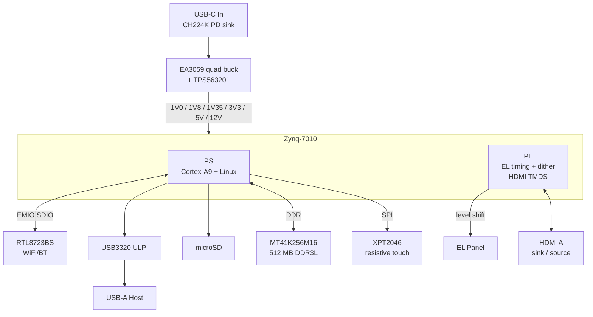

# ePass EL or elPass

**An open-source EL display controller built on the Xilinx Zynq-7010.**

ePass EL drives an electroluminescent (EL) panel from a Zynq-7010 SoC, pairing
PS-side Linux with PL-side panel timing so you get a real compositor on top of a
display technology that usually only sees bit-banged microcontroller drivers.
HDMI in/out, WiFi/BT, USB host, a resistive touchscreen, and USB-C PD power all
live on a single self-designed four-layer board.

> Rhodes Island Engineering Dept. (c) 1097 — *because every ruler needs a screen.*

---

## Status

| Subsystem            | State                                                        |
| -------------------- | ------------------------------------------------------------ |
| PCB (4-layer)        | **Fabricated and bring-up tested.** Working hardware.        |
| FPGA / Linux         | Architecture defined; EL driver + DRM compositor in progress |
| Enclosure            | 2-piece FDM/resin shell, parametric (build123d), in design   |

This is `Rev 1`. KiCad 10.0.3 source, schematic dated 2026-05-25.

PCB is designed for JLC04016-3313 stack.1.6mm,3313 imdepend matching.

---

## Highlights

- **Zynq-7010 (CLG400)** — dual-core Cortex-A9 PS + Artix-class PL on one die.
- **EL panel driver in the PL** — column/row drive (`UD*`/`LD*`/`CP*`/`S`) with
  1-bit temporal dithering, level-shifted to the panel through dual TXS0108E.
- **DRM/KMS on Linux** — a single-master compositor owns the CRTC; clients hand
  in buffers over dmabuf. Legacy fbdev programs and even an X server can run as
  clients without ever touching the real DRM master.
- **HDMI, both directions** — J2 is a dual-mode sink/source. Default build is a
  sink (TMDS receive into HR banks via IDELAY/ISERDES); populate `D2` to flip it
  into a source.
- **WiFi + Bluetooth** — RTL8723BS over SDIO (routed through EMIO to the PL),
  with a 2.4 GHz chip antenna and a proper RF keepout.
- **USB-C PD power** — CH224K negotiates 12 V for the panel rail; data lines
  stay free for whatever you want.
- **USB 2.0 host** — USB3320 ULPI PHY (24 MHz) to a full-size Type-A port.
- **Resistive touch** — XPT2046 over SPI.
- **microSD** boot + storage, RTC-less but with the usual JTAG/UART debug paths.

---

## Architecture

### PS / PL split

- **PS** runs Linux and owns the slow-and-smart side: USB, SD, the RTL8723BS
  (SDIO bridged out through EMIO to PL pins), DDR3L, and the touch SPI link.
- **PL** owns the timing-critical side: generating EL panel drive waveforms with
  1-bit dithering, and the HDMI TMDS datapath.

---

## Power tree

USB-C comes in, CH224K trips the source to **12 V**, and everything fans out from
there. The Zynq rails are brought up in the order the datasheet asks for.

| Rail   | Source       | Notes                                  |
| ------ | ------------ | -------------------------------------- |
| +5 V   | TPS563201    | Buck from VBUS                         |
| +1.0 V | EA3059       | `VCCINT` / `VCCPINT`                    |
| +1.8 V | EA3059       | `VCCAUX` / `VCCPAUX` / MIO bank 1       |
| +1.35 V| EA3059       | DDR3L `VCCO_DDR`                        |
| +3.3 V | EA3059       | I/O banks, MIO bank 0, last to rise    |

**Sequence:** `1.0 V → 1.8 V → 1.35 V → 3.3 V`
(approx. instant → 22 ms → 41 ms → 55 ms, set by the enable-cap timing).
A **MAX811** supervises the last-rising 3.3 V rail and drives `PS_POR_B`.

**Panel budget:** 5 V @ 300 mA max, 12 V @ 1.3 A max.

---

## Boot configuration

Mode straps live on the MIO pins (see `zynq_misc`):

| Pins      | Value      | Meaning                                   |
| --------- | ---------- | ----------------------------------------- |
| MIO[6]    | `0`        | Wait for PLL lock, then run BootROM       |
| MIO[8:7]  | `2'b10`    | 3.3 V on both MIO banks                    |
| MIO[5:3]  | `3'b110`   | Boot from SD card                          |
| MIO[2]    | `0`        | JTAG chain: cascaded                       |

PS reference clock is a 50 MHz oscillator. JTAG is broken out on a ZX-SH1.0
header for bring-up.

---

## Software stack

The interesting part isn't that it runs Linux — it's *how the display is shared.*

- **Single-master DRM compositor.** A DRM lease can't split a CRTC between two
  masters, so one compositor owns all atomic commits. Clients submit buffers as
  dmabuf file descriptors passed over a Unix socket (`SCM_RIGHTS`).
- **Legacy fbdev support** via `LD_PRELOAD`, intercepting `open`/`ioctl`/`mmap`
  so old framebuffer programs think they own a screen.
- **X11 as a client** — `xf86-video-fbdev` runs against the compositor's virtual
  framebuffer, keeping the compositor as the sole DRM master.
- **Touch routing.** The real input device is grabbed (`EVIOCGRAB`) and a virtual
  device is published via `uinput`/`libevdev`; the compositor routes events by
  overlay visibility. On focus switch, in-flight multitouch slots are cancelled
  cleanly (`ABS_MT_TRACKING_ID = -1`, `BTN_TOUCH = 0`, `SYN_REPORT`). A udev rule
  (`LIBINPUT_IGNORE_DEVICE=1`) hides the raw device from X's libinput.

## Credits

This design stands on the shoulders of:

- **ZYNQ_Ruler** by Stanlazy — <https://github.com/Stanlazy/ZYNQ_Ruler>
- **Enchanter** by Modos Tech / Wenting Zhang
- **EBAZ4205** community reverse-engineering work

Thanks to everyone who documented Zynq-7010 minimal designs and EL driving so the
rest of us didn't have to start from a blank schematic.

---

## License

CERN-OHL-P.
